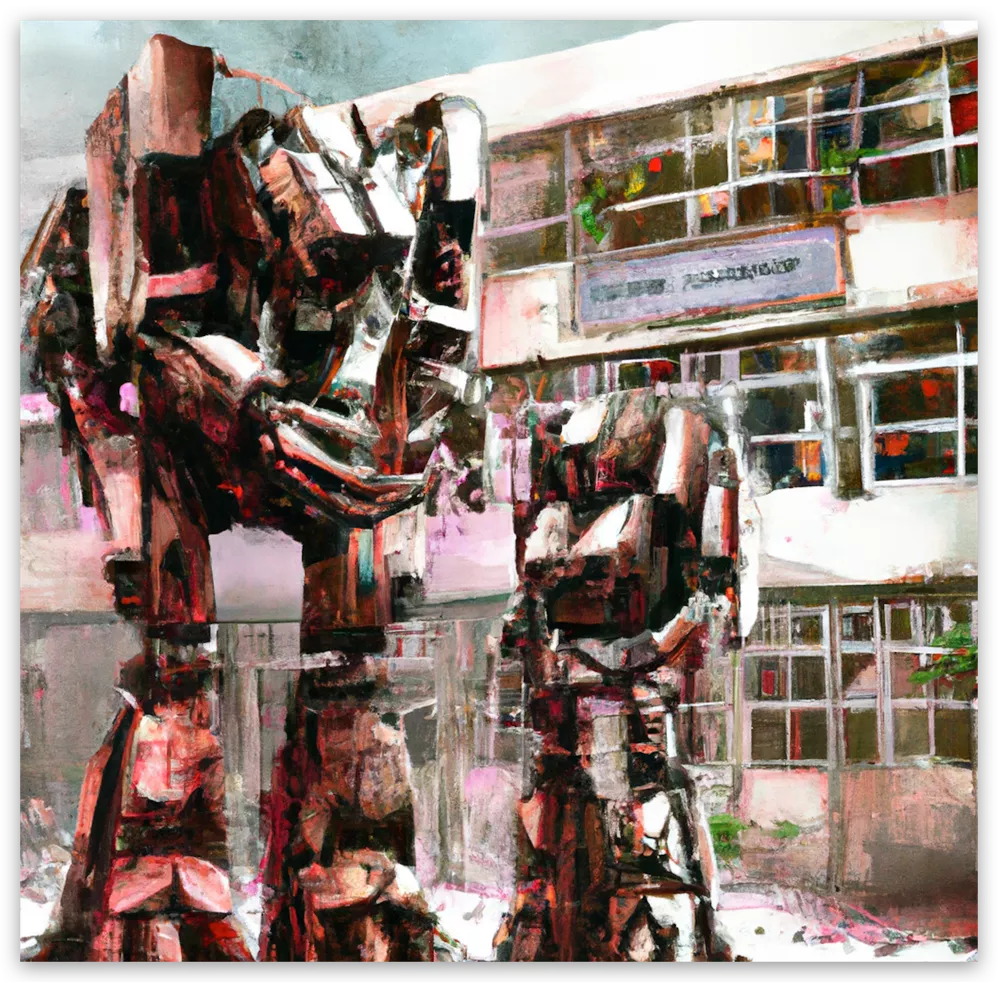

> 有时候做的梦是真的精彩，试试能不能记录下

说是校园，实际上是避难所，大家都堆积在住宿楼生活。
2040年，除了已经常态化的新冠疫情，还有一种更加可怕的瘟疫正在肆虐全球，由于这种瘟疫致死率极高，政府管控比新冠严格多了，几乎所有小区都被封锁了起来。而今天科技也十分发达，甚至在学校门口都还有两个重型机甲看守。往日繁华的街头现在一个人都没有，广告牌也年久失修，颇有一番末日丧尸的感觉。

每天，我靠着政府发放的口粮勉强支撑着生活，但食物品质和数量都很有限。然而，今天有些不一样，手机群里有人说解封了，可以出校园了。我从床上爬了起来，早已经忘记了外面的世界是什么样子，此时我还是很想出去看看。

我往校门口走去，却发现围栏有好多破洞，想着校园已经解封，大家高兴得破坏了围栏也正常，对我而言还省了一节路，没多想就钻了出去。

外面很久没有人类活动了，树木花草都长得格外好，现在正值秋天，红树叶直接把面前整座山都覆盖了，阳光穿过薄雾穿过树林摇曳闪烁，看起来十分壮观美丽，深呼吸一口，感叹到外面可比学校破墙烂楼好太多了。

继续往街区走去，街上还是没什么人，不过好在有两家商店开着，选购好东西我就准备回来了，正悠闲走在马路上欣赏风景时，却听到学校响起了警报，匆匆跑往校门口，两个机甲却把我拦住了，我有点奇怪，不是说解封了吗？怎么又不让进？想去询问可它们只是两个不会交流的机器，哎，科技以人为本就是个伪命题。我只好跑回我出来的围栏。

不料那里却站满了警卫队，他们拿着警棍正在制服准备从破洞进入学校的人，围栏也被他们修复得七七八八。我想从这里肯定回不去学校了，于是偷偷往回走寻找其他能进入学校的地方。

在路上我遇到一个和我一样回不去学校的人，我们一起商量如何才能回去。

由于很少出学校，我们艰难的在脑海中勾勒出学校的样子：学校建在半山腰，只有前后门有路，想从侧面进入学校的话只能从爬山，我们站在桥上向山底望去，通往山顶的只有一条小溪，小溪上面是瀑布，换做平时我一定喜欢这个地方，但这次我们要淌过去，我倒希望这些景象只是一条平平无奇的小路。

这条路比想象中还艰难，我们爬上去都已经晚上了，不过运气较好的是这边没人看守，我们翻过围墙道别后就各自回宿舍了。

回到宿舍，洗漱睡觉，累了一天了睡觉也格外香，一觉直接睡到天亮，直到警报把我吵醒，这一次仿佛四面八方都有警报声，迅速起床向窗外看去，外面的人全都乱作一团，尖叫着向四面八方奔散。我迅速清醒起来，看来这次真有大事要发生了，不久尖叫声就传播到了楼下，然后是一楼，二楼，三楼，我就在三楼走廊，不知所措，我望向楼梯上奔跑的人群，我终于知道大家在尖叫什么了，人群中有一个满嘴是血的人，手中还拿着半条断臂，身体本能让我快速回到房间，紧锁房门。

我疯狂思考到底发生了什么，脑海中无数个电影片段闪过，这明显就是丧尸啊。

我突然明白，围墙也许不是学校的人弄坏的。

我心中的恐惧达到了顶峰，但同时也感到一股强烈的求生欲望涌上心头。我开始收拾行李，准备离开学校去寻找安全的地方。在这个已经被瘟疫和丧尸笼罩的世界里，我要为自己活下去。

> 完