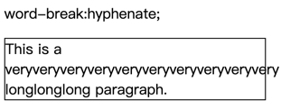
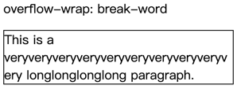

学习过 css 应该就会知道 css 里有一个 word-break 属性，默认换行行为如下图，它对于长单词不会换行，因为它不会打破单词。


如果你想要解决这个问题，需要使用 break-all，但这也会导致另一个问题：正常的单词也被打破了（下图中的 paragraph 单词就被打破了）。


能不能最大程度的不打破单词，当一行放不下一个单词才打破单词呢？这样能得到一个最优的排版，如下图



在 css 中，我们可以使用 ['overflow-wrap: break-word;'](https://developer.mozilla.org/zh-CN/docs/Web/CSS/overflow-wrap) 来达到目的。

这篇文章将讲解如何使用 Golang 实现它的算法。我的使用场景是解决 "excel 文字自动换行" 问题。

下面是它的实现要点，如果你不感兴趣的话，也可以直接使用我的包：[github.com/zbysir/textwrap](https://github.com/zbysir/textwrap)

## 计算文字宽度
由于每种字体对于每个文字的宽度设计是不一样的，比如等宽字体与非等宽字体。所以我们如果要计算文字宽度就需要处理字体文件。

不用担心，测量字体与解析字体都已经有成熟的库了：golang.org/x/image，获取宽度的代码如下：
```go
package textwrap

import (
	"github.com/golang/freetype/truetype"
	"golang.org/x/image/font"
	"os"
)

func fontWidth(f font.Face, s string) float64 {
	advance := font.MeasureString(f, s)
	return float64(advance >> 6)
}

func parseFontFace(fontBody []byte, fontSize float) *font.Face{
  f, _ := truetype.Parse(fontBody)
  face := truetype.NewFace(f, &truetype.Options{
		Size: fontSize,
	})
  return face
}

func main()  {
  bs,_ := os.ReadFile("xxx.ttf")
  ff := parseFontFace(bs, 12)
  width := fontWidth(ff,"test text")
}

```

## 拆分单词
如果获得最佳的阅读友好度，不应该在换行时打破一个完整的单词，所以我们需要先预先计算"可以在哪里换行"。

对于英文，我们只需要在空格处换行即可，对于汉字则每个字符都可以换行。

其中难点是如何判断字符是否是"汉字"，实际比我想象中难，除了中文、日文或韩文（CJK）之外，全角符号（如。）也需要处理为可换行，偷懒一点的办法是判断是否是全角即可（CJK 都是全角），使用 "unicode/utf8" 包即可判断。

```go
package textwrap

import (
	"unicode"
  "unicode/utf8"
)

// return "break opportunities" (http://unicode.org/reports/tr14/)
func breakLine(x string) []string {
	var result []string
	pi := 0
	prevKind := -1
	rs := []rune(x)
	for i, c := range rs {
		var kind = -1
		if !unicode.IsSpace(c) {
			kind = utf8.RuneLen(c)
		}

		isWide := kind >= 3
		// break on each Wide char and space
		if (kind != prevKind || isWide) && i != 0 {
			result = append(result, string(rs[pi:i]))
			pi = i
		}
		prevKind = kind
	}
	result = append(result, string(rs[pi:]))
	return result
}

// in test file

func TestBreakLine(t *testing.T) {
	lines := breakLine("标准的具体规则在Unicode 换行算法 (Unicode Line Breaking Algorithm, UAX #14）中详细给出。")
	assert.Equal(t, []string{"标", "准", "的", "具", "体", "规", "则", "在", "Unicode", " ", "换", "行", "算", "法", " ", "(Unicode", " ", "Line", " ", "Breaking", " ", "Algorithm,", " ", "UAX", " ", "#14", "）", "中", "详", "细", "给", "出", "。"}, lines)
}

```

至此我们实现了 95% 左右的换行需求，还有 5% 呢？

其实排版规则很复杂，不光是不能打破单词，比如不能将。放在行首，在《符号标点用法》中有这样一些规则：

> 句号、逗号、顿号…不出现在一行之首…引号、括号、书名号…前一半不出现在一行之末，后一半不出现在一行之首  ——《标点符号用法》

英文也有类似的规则，具体规则在 [Unicode 换行算法 (Unicode Line Breaking Algorithm, UAX #14)](http://unicode.org/reports/tr14/) 中详细给出。

要完全满足标准排版规则的算法尤其复杂，有 JavaScript 版本的实现: [niklasvh/css-line-break](https://github.com/niklasvh/css-line-break)，而在 Golang 中没找到它的实现，这是一个大工程，所以暂不做了，95% 已满足我的需求。

## 打破单个单词
如果一行都放不下一个单词，就需要打破单词，在单词之间换行。

```go
package textwrap

func breakWord(s string, over func(string) bool) ([]string, string) {
	var result []string
	runes := []rune(s)
	for len(runes) != 0 && over(string(runes)) {
		max := 0
		for i := range runes {
			if over(string(runes[:i+1])) {
				max = i
				break
			}
		}

		if max == 0 {
			max = 1
		}

		result = append(result, string(runes[:max]))
		runes = runes[max:]
	}

	return result, string(runes)
}
```

## 换行代码
```go
package textwrap

// TextWrap Wrap text without breaking words as much as possible;
// Support Chinese characters and super long words
func TextWrap(s string, over func(string) bool) []string {
	var result []string
	for _, l := range strings.Split(s, "\n") {
		words := breakLine(l)
		line := ""
		for _, next := range words {
			testLine := line + next
			if !over(testLine) {
				line = testLine
				continue
			}

			if strings.TrimSpace(line) == "" {
				line = next
				continue
			}

			i, last := breakWord(line, over)
			result = append(result, i...)
			// 如果一个单词被分为了多行则需要处理最后一行，尝试拼接 next
			//  case:
			//  |Unite|
			//  |d St |
			if last != "" {
				if !over(last + next) {
					line = last + next
					continue
				} else {
					result = append(result, last)
				}
			}

			// 超出之后下一个单词就是下一行的开始
			line = next
		}

		if strings.TrimSpace(line) != "" {
			word, last := breakWord(line, over)
			result = append(result, word...)
			if last != "" {
				result = append(result, last)
			}
		}
	}

	for i, line := range result {
		result[i] = strings.TrimSpace(line)
	}
	return result
}

```

## 完整代码

已发布到 Github [zbysir/textwrap](https://github.com/zbysir/textwrap)。

快速使用：
```bash
go get github.com/zbysir/textwrap
```

## 参考文章
- https://www.cosformula.org/canvas-text-wrap