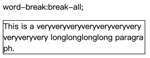

学习过 css 应该就会知道 css 里有一个 word-break 属性，默认换行行为如下图，它对于长单词不会换行，因为它不会打破单词。


如果你想要解决这个问题，需要使用 break-all，但这也会导致另一个问题：正常的单词也被打破了（下图中的 paragraph 单词就被打破了）。


能不能最大程度的不打破单词，当一行放不下一个单词才打破单词呢？这样能得到一个最优的排版，如下图


这篇文章就是为了实现它。只不过我的使用场景是解决 "excel 文字自动换行" 问题，并且是 Go 语言。

下面是实现要点，如果你不感兴趣的话，也可以直接使用我的包：https://github.com/zbysir/textwrap

# 计算文字宽度
由于每种字体对于每个文字的宽度设计是不一样的，比如等宽字体与非等宽字体。所以我们如果要计算文字宽度就需要处理字体文件。

不用担心，测量字体与解析字体都已经有成熟的库了：golang.org/x/image，获取宽度的代码如下：
```go
package textwrap

import (
	"github.com/golang/freetype/truetype"
	"golang.org/x/image/font"
	"os"
)

func fontWidth(f font.Face, s string) float64 {
	advance := font.MeasureString(f, s)
	return float64(advance >> 6)
}

func parseFontFace(fontBody []byte, fontSize float) *font.Face{
  f, _ := truetype.Parse(fontBody)
  face := truetype.NewFace(f, &truetype.Options{
		Size: fontSize,
	})
  return face
}

func main()  {
  bs,_ := os.ReadFile("xxx.ttf")
  ff := parseFontFace(bs, 12)
  width := fontWidth(ff,"test text")
}

```

# 拆分单词
如果获得最佳的阅读友好度，不应该在换行的时候打破一个完整的单词，所以我们需要先解析出单组。

站在巨人的肩膀上看得更远，搜索 golang 的绘图库，可以找到这个库：https://github.com/fogleman/gg，其中实现了文字换行，不过对中文支持不友好，我们拿来改改。

```go
package textwrap

import (
	"unicode"
)

func splitOnSpace(x string) []string {
	var result []string
	pi := 0
	ps := false
	for i, c := range x {
		isHan := unicode.Is(unicode.Han, c)
		s := unicode.IsSpace(c) || isHan
		if (s != ps || isHan) && i > 0 {
			result = append(result, x[pi:i])
			pi = i
		}
		ps = s
	}
	result = append(result, x[pi:])
	return result
}

// on test file

func TestSplitOnSpace(t *testing.T) {
	line := splitOnSpace("本文实例讲述了Go语言清除文件中空行的方法。")
	bs, _ := json.Marshal(line)
	// ["本","文","实","例","讲","述","了","Go","语","言","清","除","文","件","中","空","行","的","方","法","。"]
	t.Logf("%s", bs)
}

```

# 打破单个单词
如果一行都放不下一个单词，就需要打破单词，在单词之间换行。

```go
package textwrap

func breakWord(s string, over func(string) bool) ([]string, string) {
	if !over(s) {
		return nil, s
	}
	var result []string
	for {
		for i := range s {
			if !over(s[:i+1]) {
				continue
			}

			result = append(result, s[:i])
			s = s[i:]
			break
		}
		if s == "" || !over(s) {
			break
		}
	}

	return result, s
}
```

# 换行代码
```go
package textwrap

func textWrap(s string, over func(string) bool) []string {
	var result []string
	for _, l := range strings.Split(s, "\n") {
		words := splitOnSpace(l)
		line := ""
		for _, word := range words {
			testLine := line + word
			if over(testLine) {
				if strings.TrimSpace(line) != "" {
					i, s2 := breakWord(line, over)
					result = append(result, i...)

					// 将最后一行尝试拼接下一个单词，如果超出，则不拼接
					// case:
					//  Unite
					//  d St
					if !over(s2 + word) {
						line = s2 + word
					} else {
						if s2 != "" {
							result = append(result, s2)
						}
						line = word
					}
				} else {
					line = word
				}
			} else {
				line = testLine
			}
		}

		if strings.TrimSpace(line) != "" {
			word, s2 := breakWord(line, over)
			result = append(result, word...)
			if s2 != "" {
				result = append(result, s2)
			}
		}
	}

	for i, line := range result {
		result[i] = strings.TrimSpace(line)
	}
	return result
}

```

# 完整代码

已发布到 Github
```bash
go get github.com/zbysir/textwrap
```

# 参考文章
- https://www.cosformula.org/canvas-text-wrap