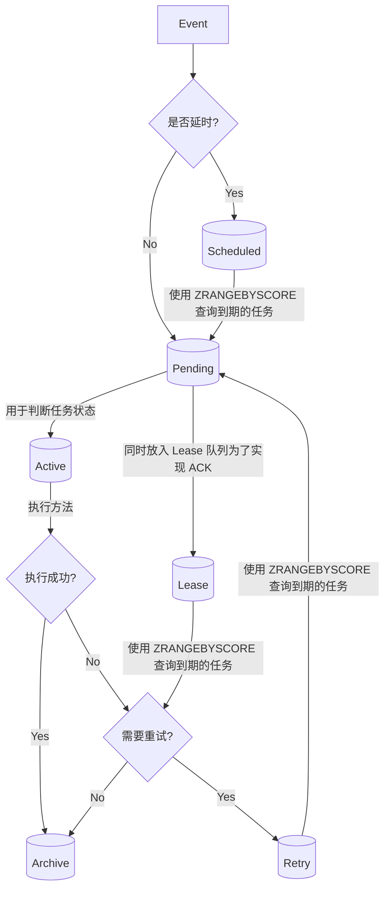

我在 Golang 的生态里一直没找到好用的延时任务方案，在之前的工作中需要的时候也是自己[实现了一个简易方案](https://www.jianshu.com/p/83f37db7b078)，它有诸多问题，比如部署复杂，稳定性不够。

直到 2022 年我知晓了 [Asynq](https://github.com/hibiken/asynq)。

Asyncq 这样介绍自己：

> Simple, reliable & efficient distributed task queue in Go
> 
> Go 中简单、可靠、高效的分布式任务队列
> 
> Asyncq is a Go library for queueing tasks and processing them asynchronously with workers. It's backed by Redis and is designed to be scalable yet easy to get started.
> 
> Asynq 是一个 Go 库，用于排队任务并通过工作者异步处理这些任务。它由 Redis 支持，被设计成可扩展且容易上手。

Asyncq 过去一年在公司业务中调度了超过 5000w 个任务，确实高效没出过问题，并且使用的 Redis 人手都有，部署难度很低。

现在空下来研究下它的实现原理，发现比想象中更复杂也有趣。

## 总体流程
- 入队：
  - 使用 有序集合 `scheduled` 记录异步任务。
  - 如果不是延时任务（立即执行），则直接加入到 `pending` 队列。
- 前进：
  - 使用 `ZRANGEBYSCORE` 定时从 `scheduled` 和 `retry` 队列查询到期的任务，并使用 `ZREM` 删除 任务，并插入到 `pending` 队列。 （！必须使用 script 才能满足原子性）
- 出队：
  - 使用 `RPOPLPUSH` 将`pending` 的任务放入`active` 队列，并将任务放在有序集合 `lease`（延时 30 s）
- 执行任务：
  - 成功执行了之后 将任务从 `active` 和 `lease` 移除，然后存入归档。
  - 执行失败，执行 retry：将任务从 `active` 和 `lease` 移除，（如果没有移除成功，则不做任何处理），放入有序集合 `retry` （延时 N s）
  - 如果服务正在退出则重入队列：将任务从 `active` 移除，从`lease` 移除，添加到 `pending` 队列。
  - 超时没有 ACK：定时从 `lease` 取出任务，检查最大重试次数，如果没有超过最大重试次数就执行 retry。否则就存档标记为失败。（注意这里可以不使用 script 实现原子操作，因为 retry 命令是幂等的。）


> 流程图可能画得不够好，将就看看辅助理解。

## 要点

### 保证原子性
> 原子性是指操作在执行过程中不可被中断或分割，要么全部执行成功，要么全部失败回滚，保证操作的完整性和一致性。
> 在并发环境下，原子性是确保多个线程在同时访问共享资源时，对共享资源的操作不会相互干扰从而导致数据不一致。

由于在某个动作中需要操作多个队列，为了实现原子性，则需要使用 script 命令来执行操作，比如一次出队列操作如下：
```go
var dequeueCmd = redis.NewScript(`
if redis.call("EXISTS", KEYS[2]) == 0 then
	local id = redis.call("RPOPLPUSH", KEYS[1], KEYS[3])
	if id then
		local key = ARGV[2] .. id
		redis.call("HSET", key, "state", "active")
		redis.call("HDEL", key, "pending_since")
		redis.call("ZADD", KEYS[4], ARGV[1], id)
		return redis.call("HGET", key, "msg")
	end
end
return nil`)


```

### 保证至少执行一次
由于程序的崩溃可能发生在任何地方，为了保证不丢数据，和 MQ 一样，我们必须设计一个 ACK（确认 Acknowledgement）机制，如果超过一段时间程序没有应答（无论成功和失败都算应答）则需要重试。这也是整个系统最复杂的地方，可以说将复杂度扩大了几倍。

在 asyncq 中出队列时，不光使用 `RPOPLPUSH` 将 `pending` 的任务放入 `active` 队列，同时也会将任务放在有序集合 `lease`（默认延时 30 s），然后定时从 `lease` 查询出过期的任务并重试。

### 避免重复执行
并发可能导致判断失效而重复执行，asyncq 在不同场景使用不同机制来避免重复执行：
- 出队列：asyncq 中使用了 redis script 实现并发控制（先查询后删除两步操作）来避免一个任务被多次查询出来并执行。
- 超时重试：1. 定时从 `lease` 查询出过期的任务，2. 再检查重试次数之后重新放入 `retry` 集合，并从 `active` 和 `lease` 移除任务，
  由于步骤 1 和 2 无法像出队列时做在一个 script 中，所以当多个 pod 并发查询时会查询到同一个任务，如果都往 `retry` 集合放入的话就会导致重复执行
  为了避免这个问题，可以先从 `active` 和 `lease` 移除任务，只有当移除成功之后才会放入 `retry` 集合。
