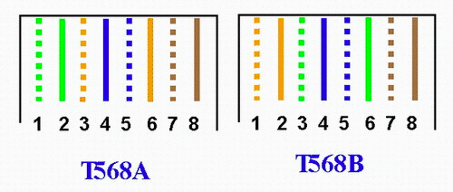

import Tags from "./Tags";

小时候父亲给我买了十万个为什么，成为了我第一本爱看的图书。但生活却不止十万个为什么，依然有太多的东西需要去学习与记忆。于是我想记下我需要的为什么，以免日后忘记，通常它们比较短小，合适组成一个合集。

那先小定一个小目标，叫 一百个为什么。

将包括科学，生活，编程，我自己，是个大杂烩。

# 物体的速度能超越光速吗？
<Tags tags={"物理,科学"}/>
对于不同参考系来说答案不同，对于自己的参考系，是可以超越光速的。由于光速在任何参考系都不变，对于你速度再快也追不上光，因为光以恒定的速度远离你，对于其他人看来，你也一直追不上光，所以在别人眼里，你永远会低于光速。而你自己可以一直加速，没有什么可以限制你提速，超越光速是迟早的事。(不过有理论说 速度越大 质量也越大，当你接近光速时，质量也接近无穷大，也就没办法加速了)

# 什么是慢钟效应？
<Tags tags={"物理,科学"}/>
> 摘至 https://mp.weixin.qq.com/s/eOD3kq99WM_IEQV2gzQ8bA

你疯狂加速，达到了超光速，速度 10 倍于光速，10 光年的距离你一年就到了，但实际上你的速度永远低于光速，其他人看你还是按低于光速的速度慢慢飞过来的，但其他人过了 10 年，你这里才过了 1 年，所以你感觉自己一年就到了，肉体也只衰老了一岁，看起来好像是超光速了。

# 为什么光速不变
<Tags tags={"物理,科学"}/>
> 摘至 https://mp.weixin.qq.com/s/eOD3kq99WM_IEQV2gzQ8bA

至于为什么无论你向哪个方向飞，以多快的速度飞，光都会永恒的以光速 C 值远离你或靠近你，为什么光速会有如此奇怪的特性？这个叫宇宙常数，没人知道为什么，科学家只知道宇宙就是这么运转的，目前最顶级的宇宙常数就是光速 C 值，无人可以突破。

# 什么是测不准原理？
<Tags tags={"物理,科学"}/>
在微观世界，观测就会引起事物的改变，在没测量之前，量子的状态处在叠加态，当观测时，叠加态就会按几率坍缩成一个状态。每次测量结果都是随机的，所以叫测不准。

# 什么叫量子纠缠？
<Tags tags={"物理,科学"}/>
可以通过一些手断让多个量子发生纠缠(todo.)，无论他们相隔多远，当我们测量其中一个量子的时候，其他的量子也会坍缩成一个状态。比如我们如果测量到一个量子的状态是1，那么在测量纠缠量子的时候就一定是0。猜测一是: 他们之间仿佛有超越光速的通讯机制来协调他们的状态，猜测二是: 它们在诞生时就有一个属性在记录自己的状态，只是我们技术不够还没测量出来到，在观测的时候通过坍缩我们才能看见不同的状态，这也是爱因斯坦的理论，但已经有实验推翻了这个猜想(todo)

# 婴儿湿疹怎么办？
<Tags tags={"育儿"}/>
除了推荐你上知乎了解大家的解决方案外，我也写下我们的处理方案，毕竟每个宝宝的状态都不同，知乎上的的方案对我们宝宝也不太有效。

三大方法：保湿，低激素药，肌则初。

保湿是基础，也最重要，每天不下于 4 次大量图保湿霜。找医生开低激素药，激素药有副作用，医生会说不能连续用药超过一周，但药效也是最快的。我的用药方式是 连续用药3天 一般就会好，然后继续保湿，但一般几天后又会复发，然后再次用药，循环，就硬拖，等宝宝大一点皮肤保障能力完善后就会完全好转。
我宝宝从 2 月龄直到 4 月龄一直都在反复，也看了医生用了很多其他药物都不见成效，但最后我老婆在小红书上看见有人推荐 肌则初，也买来试试，还真有用(同时宝宝自己的皮肤屏障也差不多完备了，直接给治好了，现在它成了常备药，如果红屁屁，发痒都用它 有奇效。

# 如何买房？
<Tags tags={"生活"}/>
关注当地公众号，如成都本地宝，他们会维护最新的政策变动，问他们即可。

成都选新房关注购房通，二手房直接找中介

# 如何落户？{#落户}
<Tags tags={"生活"}/>
- 成都本地宝搜索"落户"
- 查看微信公众号 - 成都微户政，线上预约，会提示你要准备的资料

由于不同落户方式需要不同的材料，下面只会列举必要材料，详细还是查看 成都微户政。

户口本，身份证，申请表（成都微户政提供模板），居住登记，成都市人才码 (百度)，成都市无房证明 (百度)

# 如何卖房户口迁出？
<Tags tags={"生活"}/>

TODO

# 什么是深度学习？
<Tags tags={"技术"}/>

TODO

每一个神经元都会与上层所有神经元连接，但权重不一样（可以理解每个神经元对不同特征的敏感度不一样）

3b1b 的视频

# React hooks 产生的变量，如 useMemo 产生的 Memoization value 如何存储。
<Tags tags={"技术,前端"}/>
useMemo 看起来只是无副作用的函数调用，没有给它传递任何的如组件实例这样的能持久化数据的对象，那它计算出来的值是存放在哪里的？

答案是在每次运行方法函数的时候 提前将组件实例复制给一个全局变量，在 useMemo 中就可以使用这个组件实例来存储变量。

# 为什么 React hooks 不能写在 if 分支里？
<Tags tags={"技术,前端"}/>
上一个问题懂了？实际上还隐藏了一个细节，useMemo 的方法调用同样没有传递能区分多次 useMemo 调用的”唯一键“，那为什么多次 useMemo 能够对应上？你可能会想到是通过 create 函数的变量地址来确定唯一，但方法组件每次都会运行，create 函数每次的变量地址都会不一样。

那唯一能区分多次 useMemo 调用的”唯一键”，只有顺序了：第一次 useMemo 对于 第一个 Memoization value。那么为什么不能把 hooks 写在 if 里就不难理解了。

实际上 React 也可以通过代码预处理的方式将每一个 hook 生成唯一 key，但这样会增加复杂度。

# 为什么电动机不转动就会发热烧毁？
<Tags tags={"物理"}/>

- 电机有多组线圈，在转动时是在交替工作的，可以散热，而不转动就只有一组线圈在通电。
- 线圈在磁铁中转动时能产生同向电流，所以做功电压更小。

# 如何实现量子逻辑门？
<Tags tags={"物理,科学"}/>
> 【复杂的量子逻辑门，竟然只是在做旋转-哔哩哔哩】 [https://b23.tv/3naZOr2](https://b23.tv/3naZOr2)

单个量子可以理解为一个球，他有自旋角度，一个量子是同时处于任何角度的叠加态，只有被测量才会坍缩为一个角度。

和普通逻辑门一样，也可以对量子进行 非、异或等操作：

我们记从上到下旋转为 1，从下到上选择为0，"非"操作只需要对量子进行旋转180度即可，有物理装置可以做到（我不清楚具体是怎么操作的，猜测让光进行一次反射之类的？）

# 如何安装充电桩？
<Tags tags={"生活"}/>

1. 去**汽车 app 上申请安装充电桩**，等待安装充电桩的工作人员联系你（添加微信）
2. 先**问物业需要什么资料**才能申请充电桩
3. 找安装充电桩的人，按物业说的 索要尽可能多的资料，资料不全没关系，物业也会允许的，然后物业会盖章一个**允许安装说明**。
4. 下载 **网上国网 app**，申请充电桩，将允许安装说明资料和车位产权证上传。
5. 等待国网的人联系你，约定安装电表时间。最好约定安装电表 和 充电桩在一起安装。**一般来说电表需要先于充电桩安装**。
6. 安装电表之前需要**和物业商量电表需要安装在哪里**，并且也需要和充电桩师傅商量电表是否能安装，必要情况需要让充电桩师傅勘探。
7. 确定电表安装位置之后，告知电表师傅，他会来安装电表。
8. 安装充电桩师傅来的时候联系物业，**让物业和充电桩师傅一起勘察走线**（比如是否能打孔，绕线会导致费用增加很多）。
9. 在安装充电桩的时候师傅会断电操作，需要你协调物业，**让物业通知业主之后才能断电**。
10. 等待安装完成，验收签字，给钱。

# 为什么网线是互相缠绕的？
仔细观察网线中的8根线材, 发现他们都是两两绕在一起, 这样做的原因是能让它们两产生的电磁干扰互相抵消, 要让它们互相抵消, 则需要保证绕在一起的线是一个回路.

在协议中, 1, 2号线用于发送数据, 3, 6号线用于接受数据, 所以, 我们必须保证连接**1, 2口的线绕在一起**, 连接**3, 6口的线绕在一起**才能抵消电磁干扰, 对于 1000M 网络, 我们也需要让**4, 5 绕在一起**；**7, 8 线绕在一起**.

满足上面的必须规则, 也会有很多连线方式, 为了减轻心智负担, 人们还定制了国际上通用的标准, 现在只有两种接法了:
