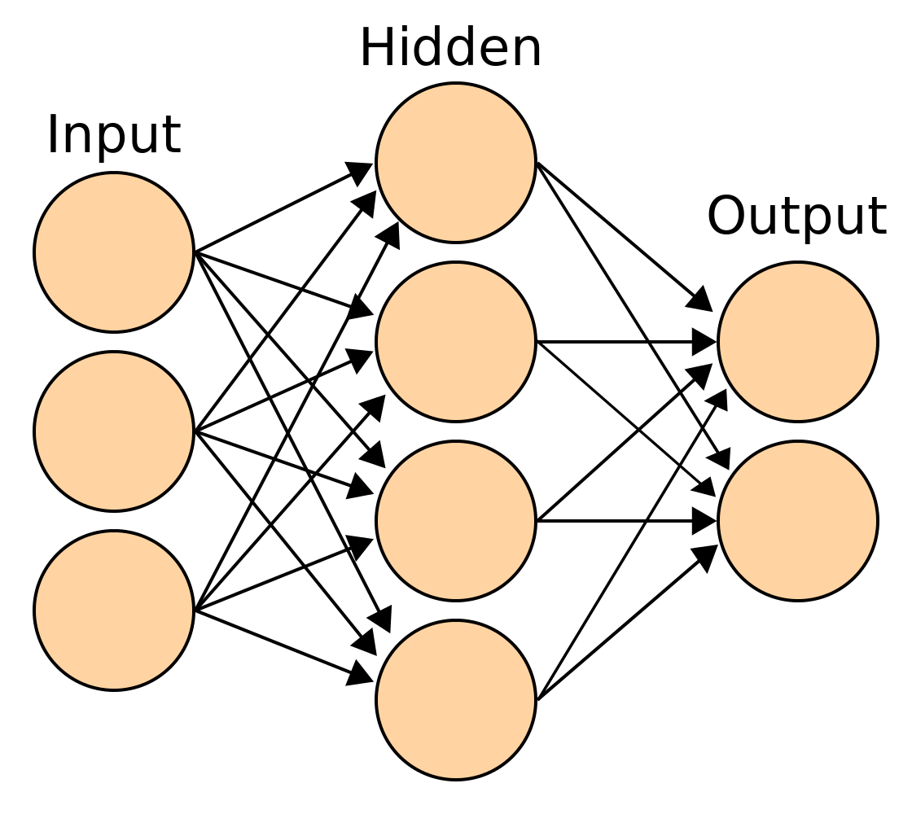

神经网络是一种用于机器学习和人工智能的计算模型，它由大量相互连接的简单处理单元（或称为神经元）组成。这些神经元模拟了生物神经系统中的神经元，通过接收输入信号、进行加权和处理，并产生输出信号来实现信息处理和决策。

在神经网络中，每个神经元将输入信号与一个权重进行加权，然后将其传递给下一层神经元。多个神经元的组合形成了一个层，层与层之间的连接构成了网络结构。通过不断地迭代、训练和调整权重参数，神经网络可以从数据中自动学习和提取有用的特征，并使用这些特征来进行分类、预测、识别等任务。

神经网络已被广泛应用于图像识别、语音识别、自然语言处理、推荐系统等领域，在人工智能和机器学习的发展过程中起到了重要作用。

如果你要学习，可以参考 3b1b 的视频：
- 神经网络：[【官方双语】深度学习之神经网络的结构 Part 1 ver 2.0](https://www.bilibili.com/video/BV1bx411M7Zx)
