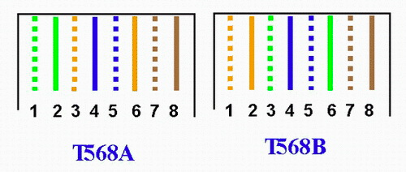

仔细观察网线中的8根线材, 发现他们都是两两绕在一起, 这样做的原因是能让它们两产生的电磁干扰互相抵消, 要让它们互相抵消, 则需要保证绕在一起的线是一个回路.

在协议中, 1, 2号线用于发送数据, 3, 6号线用于接受数据, 所以, 我们必须保证连接 **1, 2口的线绕在一起**, 连接 **3, 6口的线绕在一起** 才能抵消电磁干扰, 对于 1000M 网络, 我们也需要让 **4, 5 绕在一起** ；**7, 8 线绕在一起**.

满足上面的必须规则, 也会有很多连线方式, 为了减轻心智负担, 人们还定制了国际上通用的标准, 现在只有两种接法了:

